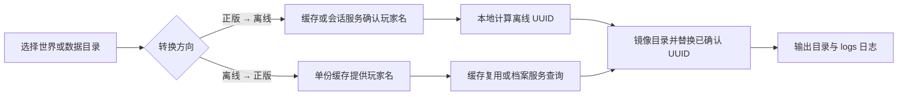

<div align="center">
  

  <h1>Minecraft UUID Convert</h1>

  <p><strong>在正版与离线模式之间，安全迁移 Minecraft Java 世界的玩家身份</strong></p>

  <p>
    <a href="LICENSE"></a>
    
    
    
    
  </p>

  <p>完整世界镜像 · 单缓存双向解析 · 二进制零改写 · 冲突零丢失 · 独立运行日志</p>
</div>

---

## 项目简介

Minecraft UUID Convert 是一款 Minecraft Java Edition 世界与玩家数据迁移工具。它可以递归镜像完整世界目录，也可以直接处理 `playerdata`、`stats`、`advancements` 或模组数据目录，在正版模式（online-mode）与离线模式（offline-mode）之间转换玩家 UUID。

项目同时提供中文桌面界面和命令行入口。源目录永远不会被修改；无法确认身份、方向不匹配或转换失败的数据会原样复制到输出目录，并写入独立运行日志。



## UUID 解析结论

Minecraft Java Edition 中，两类 UUID 的来源不同：

- **离线 UUID**：可由玩家名确定性计算。兼容服务端对 UTF-8 字符串 `OfflinePlayer:<玩家名>` 执行 Java `UUID.nameUUIDFromBytes`，即 MD5 名称型 UUID（v3），再设置标准 version/variant 位。
- **正版 UUID**：由 Minecraft 账户服务分配，不能从玩家名在本地计算；本工具通过 Minecraft Profile Lookup 服务查询当前正版档案。
- **UUID → 玩家名不可逆**：UUID 是 128 位标识符而不是玩家名编码。正版 UUID 可通过 Mojang Session Server 查询当前名称；离线 UUID 无法数学反解，必须由 `usercache.json`、`usernamecache.json` 或其他已知映射提供玩家名。

因此，本工具只需要**一份可选玩家缓存**，不再要求转换前后各准备一份：

| 转换方向 | 玩家名来源 | 目标 UUID 来源 |
| --- | --- | --- |
| 正版 → 离线 | 缓存优先；缺失时在线反查正版 UUID | 本地计算 |
| 离线 → 正版 | 缓存提供玩家名（必需） | 缓存已有 v4 时直接复用，否则在线查询 |

UUID v3/v4 用于筛选转换方向，但版本号本身不是“玩家身份”的充分证明。候选 UUID 仍须通过缓存或官方玩家服务确认；未确认数据不会被改动。

参考资料：

- [Minecraft Wiki：玩家 UUID 计算器](https://zh.minecraft.wiki/w/%E8%AE%A1%E7%AE%97%E5%99%A8/%E7%8E%A9%E5%AE%B6UUID?variant=zh-cn)
- [Java `UUID.nameUUIDFromBytes` 文档](https://docs.oracle.com/en/java/javase/21/docs/api/java.base/java/util/UUID.html#nameUUIDFromBytes(byte%5B%5D))
- [Minecraft Profile Lookup API](https://api.minecraftservices.com/minecraft/profile/lookup/name/Notch)
- [Mojang Session Server Profile API](https://sessionserver.mojang.com/session/minecraft/profile/069a79f444e94726a5befca90e38aaf5)

## 功能

- 选择世界根目录或任意数据子目录作为输入。
- 递归保留原始目录结构，生成完整输出镜像。
- 转换 UUID 文件名，包括二进制 `playerdata/*.dat`。
- 在 JSON、SNBT、TOML、YAML、配置和文本文件中替换**已确认玩家**的 UUID 引用。
- 自动识别原版 `usercache.json` 数组格式和模组常见的 `usernamecache.json` 对象格式。
- 正版转离线、离线转正版双向迁移。
- 后台执行在线查询，GUI 不会在网络访问时冻结。
- 每次运行生成 `logs/conversion-<时间>.log`，记录解析、跳过与冲突原因。
- 输出目录存在同名文件时使用 `.uuid-conflict-N` 后缀保留双方，避免覆盖或漏拷贝。

## 环境与安装

要求 Python 3.11 或更高版本。运行时仅使用 Python 标准库；`requirements.txt` 保留给传统环境，开发工具由 `pyproject.toml` 管理。

推荐使用 [uv](https://docs.astral.sh/uv/)：

```powershell
uv sync --dev
uv run minecraft-uuid-convert
```

首次运行且未填写路径时，默认读取当前工作目录的 `input/`，输出到 `output/`，日志写入 `logs/`。

也可以使用传统虚拟环境：

```powershell
python -m venv .venv
.venv\Scripts\Activate.ps1
python -m pip install -e .
minecraft-uuid-convert
```

## GUI 使用流程

1. 选择输入目录：可以是完整世界目录，也可以直接选择 `playerdata`、`stats`、`advancements` 或模组数据目录。
2. 选择“正版 UUID → 离线 UUID”或“离线 UUID → 正版 UUID”。
3. 按需选择一份 `usercache.json` 或 `usernamecache.json`。离线转正版时必须能从缓存取得玩家名。
4. 选择输出目录；留空时使用 `output/`。
5. 保持“递归处理子目录”即可镜像完整目录树。“替换文本 UUID 引用”不会解析或重写二进制 NBT 内容。
6. 点击“开始镜像并转换”，完成后检查界面摘要与 `logs/` 详细日志。

> [!IMPORTANT]
> 请在迁移前停止 Minecraft 服务端，并保留世界目录的独立备份。工具不会改动源目录，但无法替代服务器级备份与回滚方案。

## 命令行

无参数运行时打开 GUI；传入参数时进入命令行模式：

```powershell
# 正版转离线：选择完整世界目录，缓存可选
uv run minecraft-uuid-convert D:\Server\world `
  --output D:\Converted\world `
  --mode online-to-offline `
  --cache D:\Server\usercache.json

# 离线转正版：缓存用于提供玩家名
uv run minecraft-uuid-convert D:\Server\world\playerdata `
  --output D:\Converted\playerdata `
  --mode offline-to-online `
  --cache D:\Server\usercache.json
```

常用选项：

- `--no-network`：完全禁用在线玩家查询。
- `--no-text`：只转换目录/文件名，不替换文本内容。
- `--no-recursive`：只处理输入目录第一层。
- `--logs <目录>`：指定命令行运行的日志目录。

执行 `uv run minecraft-uuid-convert --help` 查看完整参数。

## 支持范围与安全策略

- 二进制 `.dat` / NBT 文件会按原字节复制；若文件名是已确认玩家 UUID，则只改名。
- 文本内容替换仅覆盖 `.json`、`.snbt`、`.toml`、`.yaml`、`.cfg`、`.conf`、`.properties`、`.txt` 等已知文本扩展名。
- 不是所选方向源版本的 UUID、无法关联玩家名的离线 UUID、官方服务无法确认的 UUID 均保持不变。
- 输出目录不得与输入目录相同，也不得位于输入目录内部，以避免递归复制。
- 输出中出现同名目标时，后处理项使用 `.uuid-conflict-N` 后缀并记录冲突；每个输入文件仍会得到一个输出副本。
- 正版玩家改名后，在线接口返回当前名称；离线 UUID 对大小写敏感，缓存中的实际名称必须准确。

## 开发与验证

```powershell
uv run ruff format --check .
uv run ruff check .
uv run pytest
```

项目使用 `src/` 布局，转换核心与 GUI 分离。`main.py` 作为旧工作流兼容入口保留；在完成 `uv sync` 后可通过 `uv run python main.py` 启动。

## 许可证

Copyright © WhiteCloudCN。项目依据 [GNU Affero General Public License v3.0](LICENSE) 发布。分发修改版本或通过网络提供其功能时，请遵守 AGPL-3.0 的源代码提供义务。
